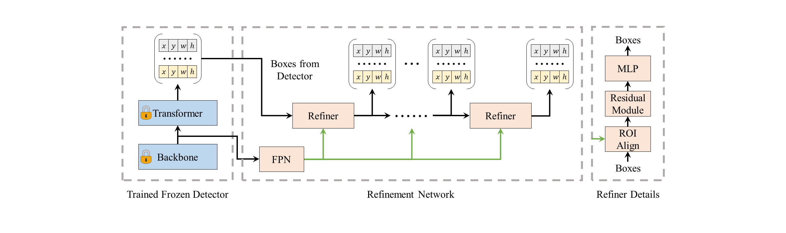

# Enhancing Your Trained DETRs with Box Refinement

Yiqun Chen, Qiang Chen, Peize Sun, Shoufa Chen, Jingdong Wang, Jian Cheng




We present a conceptually simple, efficient, and general framework for localization problems in DETR-like models. We add plugins to well-trained models instead of inefficiently designing new models and training them from scratch. The method, called RefineBox, refines the outputs of DETR-like detectors by lightweight refinement networks. RefineBox is easy to implement and train as it only leverages the features and predicted boxes from the well-trained detection models. Our method is also efficient as we freeze the trained detectors during training. In addition, we can easily generalize RefineBox to various trained detection models without any modification. We conduct experiments on COCO and LVIS $1.0$. Experimental results indicate the effectiveness of our RefineBox for DETR and its representative variants. For example, the performance gains for DETR, Conditinal-DETR, DAB-DETR, and DN-DETR are 2.4 AP, 2.5 AP, 1.9 AP, and 1.6 AP, respectively. We hope our work will bring the attention of the detection community to the localization bottleneck of current DETR-like models and highlight the potential of the RefineBox framework. Code and models will be available soon.

## Results

More details can be found in our paper.

### COCO

| Model               | Backbone   | AP   | AR $_{10}$ | AR $_{100}$ |
| -----               | --------   | ---- | ---------- | ----------- |
| DETR                | ResNet-50  | 42.0 | 53.3       | 57.5        |
| +  RefineBox (Ours) | ResNet-50  | 44.4 | 56.4       | 61.2        |
| $\Delta$            |            | +2.4 | +3.1       | +3.7        |
| DETR                | ResNet-101 | 43.5 | 54.9       | 59.0        |
| +  RefineBox (Ours) | ResNet-101 | 45.5 | 57.5       | 62.1        |
| $\Delta$            |            | +2.0 | +2.6       | +3.1        |
| Conditional-DETR    | ResNet-50  | 41.0 | 55.4       | 61.0        |
| +  RefineBox (Ours) | ResNet-50  | 43.5 | 58.8       | 65.1        |
| $\Delta$            |            | +2.5 | +3.4       | +4.1        |
| Conditional-DETR    | ResNet-101 | 42.9 | 56.7       | 62.1        |
| +  RefineBox (Ours) | ResNet-101 | 45.0 | 59.6       | 65.6        |
| $\Delta$            |            | +2.1 | +2.9       | +3.5        |
| DAB-DETR            | ResNet-50  | 43.3 | 57.5       | 62.9        |
| +  RefineBox (Ours) | ResNet-50  | 45.2 | 60.0       | 65.9        |
| $\Delta$            |            | +1.9 | +2.5       | +3.0        |
| DAB-DETR            | ResNet-101 | 44.0 | 59.0       | 65.7        |
| +  RefineBox (Ours) | ResNet-101 | 45.4 | 61.0       | 68.4        |
| $\Delta$            |            | +1.4 | +2.0       | +2.7        |
| DAB-DETR            | Swin-Tiny  | 45.2 | 58.4       | 63.5        |
| +  RefineBox (Ours) | Swin-Tiny  | 47.1 | 60.9       | 66.5        |
| $\Delta$            |            | +1.9 | +2.5       | +3.0        |
| DN-DETR             | ResNet-50  | 44.3 | 58.3       | 63.4        |
| +  RefineBox (Ours) | ResNet-50  | 45.9 | 60.3       | 66.0        |
| $\Delta$            |            | +1.6 | +2.0       | +2.6        |

### LVIS

| Model                  | AP   | AR   |
| -----                  | --   | --   |
| DAB-DETR-R50           | 19.9 | 30.1 |
| + RefineBox (Ours)     | 21.8 | 32.8 |
| $\Delta$               | +1.9 | +2.7 |
| DAB-DETR-R50 + FedLoss | 26.0 | 37.6 |
| +  RefineBox (Ours)    | 28.8 | 41.4 |
| $\Delta$               | +2.8 | +3.8 |

## TODO

- [ ] Make code publically available.
- [ ] Make models publically available.

## Cite RefineBox

If you find this work helpful, please cite:

```
@misc{chen2023enhancing,
      title={Enhancing Your Trained DETRs with Box Refinement}, 
      author={Yiqun Chen and Qiang Chen and Peize Sun and Shoufa Chen and Jingdong Wang and Jian Cheng},
      year={2023},
      eprint={2307.11828},
      archivePrefix={arXiv},
      primaryClass={cs.CV}
}
```
