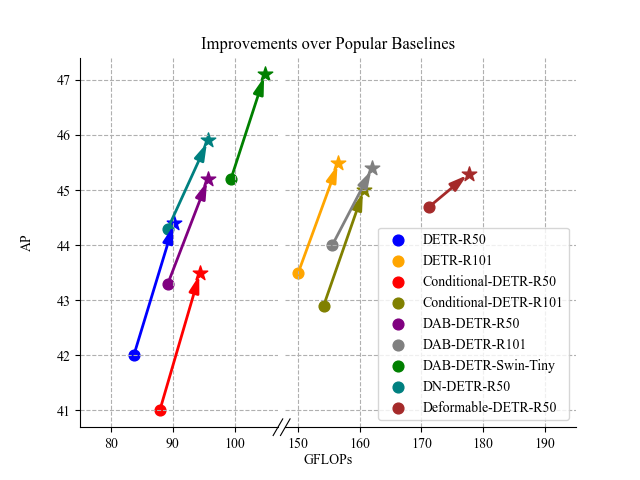
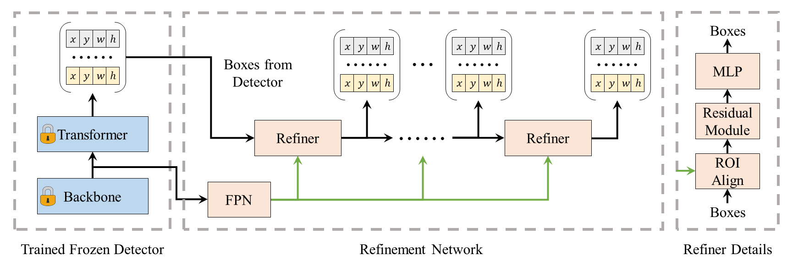

# [Enhancing Your Trained DETRs with Box Refinement](https://arxiv.org/abs/2307.11828)

Yiqun Chen, Qiang Chen, Peize Sun, Shoufa Chen, Jingdong Wang, Jian Cheng




We present a conceptually simple, efficient, and general framework for localization problems in DETR-like models. We add plugins to well-trained models instead of inefficiently designing new models and training them from scratch. The method, called RefineBox, refines the outputs of DETR-like detectors by lightweight refinement networks. RefineBox is easy to implement and train as it only leverages the features and predicted boxes from the well-trained detection models. Our method is also efficient as we freeze the trained detectors during training. In addition, we can easily generalize RefineBox to various trained detection models without any modification. We conduct experiments on COCO and LVIS $1.0$. Experimental results indicate the effectiveness of our RefineBox for DETR and its representative variants. For example, the performance gains for DETR, Conditinal-DETR, DAB-DETR, and DN-DETR are 2.4 AP, 2.5 AP, 1.9 AP, and 1.6 AP, respectively. We hope our work will bring the attention of the detection community to the localization bottleneck of current DETR-like models and highlight the potential of the RefineBox framework. Code and models are publically available at [https://github.com/YiqunChen1999/RefineBox](https://github.com/YiqunChen1999/RefineBox).

## Results

More details can be found in our paper.

### COCO

| Model               | Backbone   | AP   | AR $_{10}$ | AR $_{100}$ |
| -----               | --------   | ---- | ---------- | ----------- |
| DETR                | ResNet-50  | 42.0 | 53.3       | 57.5        |
| +  RefineBox (Ours) | ResNet-50  | 44.4 | 56.4       | 61.2        |
| $\Delta$            |            | +2.4 | +3.1       | +3.7        |
| DETR                | ResNet-101 | 43.5 | 54.9       | 59.0        |
| +  RefineBox (Ours) | ResNet-101 | 45.5 | 57.5       | 62.1        |
| $\Delta$            |            | +2.0 | +2.6       | +3.1        |
| Conditional-DETR    | ResNet-50  | 41.0 | 55.4       | 61.0        |
| +  RefineBox (Ours) | ResNet-50  | 43.5 | 58.8       | 65.1        |
| $\Delta$            |            | +2.5 | +3.4       | +4.1        |
| Conditional-DETR    | ResNet-101 | 42.9 | 56.7       | 62.1        |
| +  RefineBox (Ours) | ResNet-101 | 45.0 | 59.6       | 65.6        |
| $\Delta$            |            | +2.1 | +2.9       | +3.5        |
| DAB-DETR            | ResNet-50  | 43.3 | 57.5       | 62.9        |
| +  RefineBox (Ours) | ResNet-50  | 45.2 | 60.0       | 65.9        |
| $\Delta$            |            | +1.9 | +2.5       | +3.0        |
| DAB-DETR            | ResNet-101 | 44.0 | 59.0       | 65.7        |
| +  RefineBox (Ours) | ResNet-101 | 45.4 | 61.0       | 68.4        |
| $\Delta$            |            | +1.4 | +2.0       | +2.7        |
| DAB-DETR            | Swin-Tiny  | 45.2 | 58.4       | 63.5        |
| +  RefineBox (Ours) | Swin-Tiny  | 47.1 | 60.9       | 66.5        |
| $\Delta$            |            | +1.9 | +2.5       | +3.0        |
| DN-DETR             | ResNet-50  | 44.3 | 58.3       | 63.4        |
| +  RefineBox (Ours) | ResNet-50  | 45.9 | 60.3       | 66.0        |
| $\Delta$            |            | +1.6 | +2.0       | +2.6        |
| Group-DETR $*$      | ResNet-50  | 37.6 | 52.5       | 58.3        |
| +  RefineBox (Ours) | ResNet-50  | 40.3 | 56.1       | 62.7        |
| $\Delta$            |            | +2.7 | +3.6       | +4.4        |

> $*$ We train Group-Conditional-DETR with 11 training groups for 12 epochs.

### LVIS

| Model                  | AP   | AR   |
| -----                  | --   | --   |
| DAB-DETR-R50           | 19.9 | 30.1 |
| + RefineBox (Ours)     | 21.8 | 32.8 |
| $\Delta$               | +1.9 | +2.7 |
| DAB-DETR-R50 + FedLoss | 26.0 | 37.6 |
| +  RefineBox (Ours)    | 28.8 | 41.4 |
| $\Delta$               | +2.8 | +3.8 |


## Installation

Assume you have installed Anaconda or Miniconda, and you are using Linux.

Clone this project.

```shell
git clone https://github.com/YiqunChen1999/RefineBox.git
cd RefineBox
```

Install dependencies in one line.

```shell
bash -i ./install.sh
```

This will create a conda environment named `refinebox` and install all dependencies.

Finally, activate the environment.

```shell
conda activate refinebox
```

> NOTE: Our code is tested on PyTorch $1.13.1$ Python $3.10$. Other versions may also work.

## Dataset Preparation

We mainly conduct experiments on COCO. You can optionally choose to download LVIS $1.0$.

### COCO

Please download COCO 2017 dataset from [COCO website](https://cocodataset.org/#download). The dataset should be organized as follows:

```shell
THIS_PROJECT
      |_ datasets
            |_ coco
                  |_ annotations
                        |_ instances_train2017.json
                        |_ instances_val2017.json
                  |_ train2017
                        |_ ... # images
                  |_ val2017
                        |_ ... # images
```

### LVIS (Optional)

Please download LVIS $1.0$ dataset from [LVIS website](https://www.lvisdataset.org/dataset). The dataset should be organized as follows:

```shell
THIS_PROJECT
      |_ datasets
            |_ lvis
                  |_ lvis_v1_train_cat_info.json
                  |_ lvis_v1_train.json
                  |_ lvis_v1_val.json
                  |_ train2017
                        |_ ... # images
                  |_ val2017
                        |_ ... # images
```

`lvis_v1_train_cat_info.json` is used by the Federated loss. This is created by

```shell
python tools/get_lvis_cat_info.py --ann datasets/lvis/lvis_v1_train.json
```

## Getting Started

### Download Pre-trained Models

RefineBox improves trained DETRs, so download the pre-trained DETRs first.

Then, please change the path to the pre-trained DETRs `train.init_checkpoint` in the config files.

Taking DN-DETR as an example:

- Download the pre-trained DN-DETR from [detrex model zoo](https://detrex.readthedocs.io/en/latest/tutorials/Model_Zoo.html) and place it to your machine. The path to the model is denoted as `PATH_TO_DN_DETR`.
- Replace the value of `train.init_checkpoint` in `projects/rb_dn_detr/configs/rb_dn_detr_r50_12ep.py` with `PATH_TO_DN_DETR`.

For our trained Group-Conditional-DETR and DAB-DETR for LVIS $1.0$, you can download them [here](https://mailsdueducn-my.sharepoint.com/:f:/g/personal/201700181055_mail_sdu_edu_cn/EkQ0DNWIMP5OmQoU-E_YfMUBNZvSdpmJOylazeoSqz7gfw?e=nvt9fN).

### Train RefineBox

Train RefineBox by running:

```shell
python tools/train_net.py --num-gpus 8 --config-file PATH_TO_RB_CONFIG_FILE
```

For example (DN-DETR):

```shell
python tools/train_net.py --num-gpus 8 --config-file projects/rb_dn_detr/configs/rb_dn_detr_r50_12ep.py
```

> NOTE: We load pre-trained DETRs and RefineBox parameters separately, so you may see parameters not found warnings.

### Evaluate RefineBox

Evaluate RefineBox by running:

```shell
python tools/train_net.py --num-gpus 8 --config-file PATH_TO_RB_CONFIG_FILE --eval-only
```

For example (DN-DETR):

```shell
python tools/train_net.py --num-gpus 8 --config-file projects/rb_dn_detr/configs/rb_dn_detr_r50_12ep.py --eval-only
```

> NOTE: We load pre-trained DETRs and RefineBox parameters separately, so you may see parameters not found warnings.

## Some Tips

- If you want to run evaluation on LVIS $1.0$, please make sure numpy version is lower than $1.24.0$ as `np.float` is deprecated in numpy $1.24.0$.

## License

The model is licensed under the [Apache 2.0 license](./LICENSE).

## Cite RefineBox

If you find this work helpful, please cite:

```
@misc{chen2023enhancing,
      title={Enhancing Your Trained DETRs with Box Refinement}, 
      author={Yiqun Chen and Qiang Chen and Peize Sun and Shoufa Chen and Jingdong Wang and Jian Cheng},
      year={2023},
      eprint={2307.11828},
      archivePrefix={arXiv},
      primaryClass={cs.CV}
}
```

## Acknowledgement

This project is based on [detrex](https://github.com/IDEA-Research/detrex) and [detectron2](https://github.com/facebookresearch/detectron2). We thank the authors for their great works. We also thank [Detic](https://github.com/facebookresearch/Detic) for the Critetion with Federated Loss.
